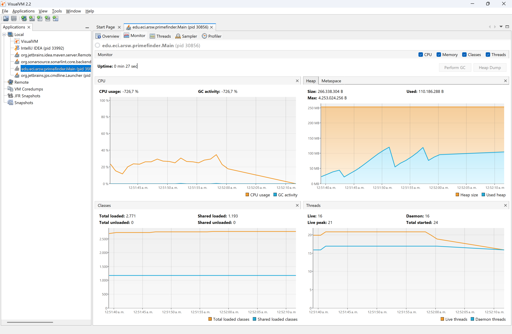
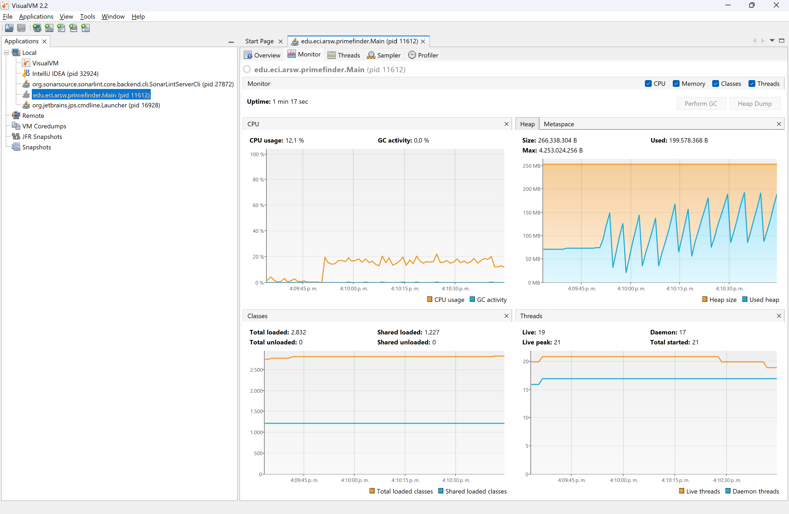
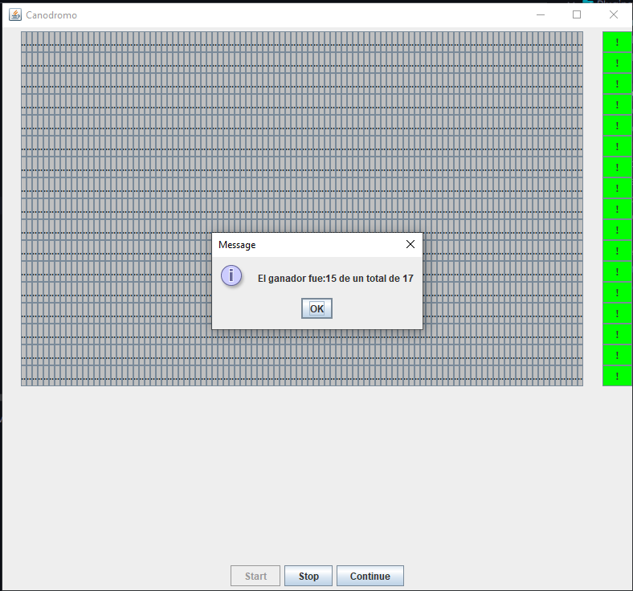
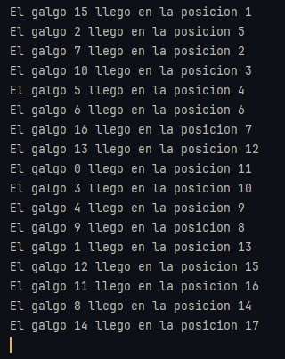

# 🧵 Laboratorio 2 - Programación concurrente, condiciones de carrera y sincronización de hilos.

**Escuela Colombiana de Ingeniería Julio Garavito**  
**Curso:** Arquitectura de Software (ARSW)

---

## 👥 Integrantes del grupo

- Vicente Garzón Ríos
- Daniel Alejandro Díaz Camelo

---

## 📌 Descripción

Este laboratorio introduce los conceptos de **programación concurrente** en Java, abordando la creación y coordinación de hilos, así como la identificación y solución de **condiciones de carrera** mediante mecanismos de **sincronización** aplicados a casos prácticos.

---

## 📂 Parte I - Creación, puesta en marcha y coordinación de hilos.

## 📌 Punto 1: Ejecución con un solo hilo

En la primera versión, el programa resuelve el problema utilizando **un único hilo**.  
La observación con **VisualVM** muestra:

- **Uso de CPU:** ~13% en promedio.
- **Threads activos (live peak):** alrededor de 18, de los cuales solo **1 corresponde al cálculo de primos** (los demás son internos de la JVM).

📷 _Evidencia (VisualVM)_

<p align="center">
  
</p>

---

## 📌 Punto 2: Ejecución con tres hilos

En la segunda versión, el programa fue modificado para resolver el mismo problema dividiéndolo en **tres partes**, asignando cada una a un **hilo independiente**.

Con esta modificación, la observación con **VisualVM** muestra:

- **Uso de CPU:** ~30% en promedio.
- **Threads activos (live peak):** hasta 21, debido a la creación de los 3 `PrimeFinderThread` más los hilos internos de la JVM.

📷 _Evidencia (VisualVM)_

<p align="center">
  
</p>

---

## 📌 Punto 3: Ejecución con control de pausa y reanudación

En esta versión, se agregó un **mecanismo de control** mediante la clase `Controller`, que permite **pausar y reanudar la ejecución de los hilos**.

El funcionamiento es el siguiente:

- A los **5 segundos** de ejecución, se detienen todos los hilos (`pause()`), mostrando el número de primos encontrados hasta ese momento.
- El programa queda en **espera de que el usuario presione ENTER**.
- Una vez presionado, se invoca a `resume()` y los hilos continúan desde donde quedaron.

Con esta implementación, la observación con **VisualVM** muestra:

- **Uso de CPU:** se observa un consumo normal durante los primeros 5 segundos, que luego cae a casi **0%** durante la pausa.
- **Threads activos (live peak):** alrededor de 21, los mismos que en el punto anterior, pero en **estado WAITING** mientras están pausados.

📷 _Evidencia (VisualVM)_

<p align="center">
  
</p>


---

## 📂 Parte II - Simulador de carreras de galgos (Canódromo) 🐕🏁

En esta parte, se trabajó con un simulador gráfico donde múltiples hilos (galgos) compiten en una pista. El resultado depende de qué hilos reciban más ciclos de CPU, simulando así el scheduling del procesador.

### 📌 Problema inicial
Los resultados se mostraban **antes de que finalizara la carrera**, ya que el hilo principal no esperaba la finalización de los galgos.

✅ **Solución:** uso de `join()` en cada galgo para esperar a que todos terminen antes de mostrar los resultados.

```java
for (int i = 0; i < can.getNumCarriles(); i++) {
    try {
        galgos[i].join();
    } catch (InterruptedException ex) {
        throw new RuntimeException(ex);
    }
}
```

---

### 📌 Condiciones de carrera
Al llegar a la meta, varios galgos accedían simultáneamente al contador de `RegistroLlegada`, produciendo **puestos duplicados o inconsistentes**.

✅ **Solución:** sincronización de la región crítica que lee e incrementa el contador.

```java
public synchronized int asignarPosicion(String nombreGalgo) {
  int posicion = ultimaPosicionAlcanzada;
  if (posicion == 1) {
    ganador = nombreGalgo;
  }
  ultimaPosicionAlcanzada++;
  return posicion;
}
```

---

### 📌 Funcionalidad de Pausa y Continuar

Se implementó un control que permite **pausar** y **continuar** la carrera de los galgos.

- Se creó un monitor compartido (`Pausa`) encargado de controlar el estado de la pausa.
- El monitor mantiene una variable `isPaused` que indica si los hilos deben detenerse.
- Cada galgo, dentro de su ciclo `run()`, llama a `pausa.waitIsPaused()`.  

Si el estado es de pausa, el hilo entra en espera (`wait()`).  
Cuando se reanuda, se invoca `notifyAll()` para que todos los hilos continúen.


---

### 📌 Verificación
1. Los resultados sólo se muestran **cuando todos los galgos han llegado**.
2. No se presentan inconsistencias en el ranking.
3. La pausa y reanudación funcionan con **un solo notifyAll()** que reactiva a todos los galgos.

📷 _Evidencia_

<p align="center">
  
</p>
<p align="center">
  
</p>

---

## ✅ Conclusiones

- Se comprendió la importancia de sincronizar **únicamente las regiones críticas** para evitar bloqueos innecesarios.
- `join()` permite coordinar la finalización de múltiples hilos antes de continuar en el hilo principal.
- El uso de `wait()` y `notifyAll()` permite implementar controles de pausa/reanudación de manera consistente en aplicaciones concurrentes.
- El laboratorio muestra cómo pequeños errores de concurrencia generan inconsistencias difíciles de detectar sin la debida sincronización.

